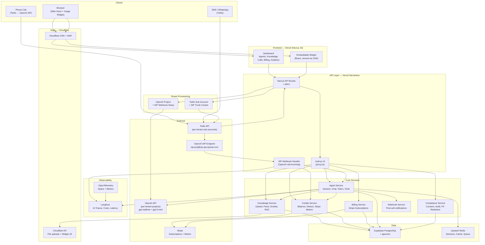

# SmartLine SaaS Platform — Production Architecture Plan (v2)

---

## 1. Scope: What We're Building

A subscription SaaS platform where businesses sign up, get their own AI voice agent (phone + web), upload their knowledge base, and pay $199/month + pay-as-you-go usage. Each subscriber gets:

- Their own **Twilio sub-account** + phone number(s)
- Their own **OpenAI project** + service account API key
- A **credits system** that meters OpenAI tokens, Twilio minutes/SMS, and charges usage monthly
- A **dashboard** to manage agents, knowledge, calls, and billing
- **Compliance-first** design: consent tracking, audit logs, PII redaction, data retention

### Two Working Voice Engines (Already Built)

| Engine | Location | Transport | How It Works |
|--------|----------|-----------|-------------|
| **Web/Browser Voice** | `Lead Agents Studio/smartline/agent.js` | WebRTC (client ↔ OpenAI direct) | Browser gets ephemeral token from backend, connects to OpenAI Realtime API client-side. Tools execute via POST to backend. |
| **Twilio Phone Voice** | `TWILLIO/src/routes/media-stream.js` | Twilio Media Streams ↔ WebSocket ↔ OpenAI | Twilio sends audio over WebSocket. `TwilioRealtimeTransportLayer` from `@openai/agents-extensions` bridges to `RealtimeSession`. Proven in production on Render. |

Both share the same **knowledge store** pattern (`TWILLIO/src/services/knowledge.js`) and **tool definitions** (`lookup_services`, `lookup_faq`, `lookup_objection`, `lookup_case_study`, `lookup_client_info`).

**Production upgrade:** Phone voice will use **OpenAI SIP Connector** instead of the WebSocket bridge — eliminates ~500 lines of code and the entire custom WebSocket server (see Section 2.3).

---

## 2. Multi-Tenant Isolation Architecture

### 2.1 Twilio Sub-Accounts (Per Subscriber)

```
Your Master Twilio Account
├── Sub-Account: "Acme Dental"
│   ├── SID: AC_acme_...
│   ├── Auth Token: (generated)
│   ├── Phone: +1 (555) 100-0001  ← provisioned via API
│   ├── SIP Trunk → points to: sip:proj_acme@sip.api.openai.com;transport=tls
│   └── Usage billed to sub-account → we read via API → charge credits
│
├── Sub-Account: "Bella MedSpa"
│   ├── SID: AC_bella_...
│   ├── Phone: +1 (555) 200-0002
│   └── ...
│
└── (up to 1000 sub-accounts, contact Twilio for more)
```

**API calls for onboarding a new subscriber:**

```javascript
// 1. Create sub-account
POST https://api.twilio.com/2010-04-01/Accounts.json
Body: { FriendlyName: "Acme Dental" }
→ Returns: { sid: "AC_acme_...", auth_token: "..." }

// 2. Search available numbers
GET /2010-04-01/Accounts/{subAccountSid}/AvailablePhoneNumbers/US/Local.json
    ?AreaCode=310&VoiceEnabled=true&SmsEnabled=true

// 3. Provision number to sub-account
POST /2010-04-01/Accounts/{subAccountSid}/IncomingPhoneNumbers.json
Body: {
  PhoneNumber: "+15551000001",
  VoiceUrl: "https://api.smartline.com/twilio/voice?tenantId=acme",
  VoiceMethod: "POST",
  SmsUrl: "https://api.smartline.com/twilio/sms?tenantId=acme",
  StatusCallback: "https://api.smartline.com/twilio/status?tenantId=acme"
}

// 4. Create Elastic SIP Trunk → OpenAI SIP endpoint
POST /2010-04-01/Accounts/{subAccountSid}/SIP/Trunks.json
Body: { FriendlyName: "smartline-acme-openai" }
// Then set origination URI:
POST /2010-04-01/Accounts/{subAccountSid}/SIP/Trunks/{trunkSid}/OriginationUrls.json
Body: {
  SipUrl: "sip:{tenantOpenAIProjectId}@sip.api.openai.com;transport=tls",
  Weight: 10, Priority: 10, Enabled: true
}
```

**Why sub-accounts:**
- Usage isolation — each sub-account's Twilio usage is tracked separately
- Billing clarity — we pull usage per sub-account to calculate credits
- Security — sub-account credentials are scoped; one tenant can't affect another
- Compliance — A2P 10DLC registration per business

### 2.2 OpenAI Projects (Per Subscriber)

```
Your OpenAI Organization
├── Project: "smartline-acme-dental"
│   ├── Service Account: "acme-production"
│   │   └── API Key: sk-svcacct-... (stored encrypted in our DB)
│   ├── Budget: $50/month (safety cap)
│   ├── SIP Webhook: https://api.smartline.com/openai/sip-webhook
│   └── Usage tracked per project in OpenAI dashboard
│
├── Project: "smartline-bella-medspa"
│   ├── Service Account: "bella-production"
│   │   └── API Key: sk-svcacct-...
│   └── Budget: $100/month
│
└── ...
```

**API calls for onboarding:**

```javascript
// 1. Create project
POST https://api.openai.com/v1/organization/projects
Headers: { Authorization: "Bearer $OPENAI_ADMIN_KEY" }
Body: { name: "smartline-acme-dental" }
→ Returns: { id: "proj_abc123", name: "smartline-acme-dental" }

// 2. Create service account + API key (returned once, store encrypted)
POST https://api.openai.com/v1/organization/projects/proj_abc123/service_accounts
Body: { name: "acme-production" }
→ Returns: { id: "svcacct_...", api_key: { value: "sk-svcacct-...", id: "key_..." } }

// 3. (Optional) Set budget
POST https://api.openai.com/v1/organization/projects/proj_abc123/budgets
Body: { budget: { type: "monthly", amount: 50.00 } }

// 4. Register SIP webhook for incoming calls
// In OpenAI Dashboard → Project Settings → Webhooks:
// URL: https://api.smartline.com/openai/sip-webhook
// Events: realtime.call.incoming
```

**Why per-subscriber OpenAI projects:**
- Usage tracked per project — we read it to calculate credit consumption
- Rate limits per project — one tenant can't starve others
- Budget caps — safety net per subscriber
- API key isolation — if one key leaks, only that tenant is affected
- SIP routing — each project has its own SIP endpoint URI

### 2.3 How Both Channels Work at Runtime

**Phone calls — via OpenAI SIP Connector (no WebSocket bridge needed):**

```
Inbound call to Twilio sub-account phone number
    │
    ▼
Twilio SIP Trunk routes call to: sip:proj_abc123@sip.api.openai.com;transport=tls
    │
    ▼
OpenAI receives SIP audio directly, fires webhook:
    POST https://api.smartline.com/openai/sip-webhook
    Body: { type: "realtime.call.incoming", call_id: "call_xyz", sip_headers: { From, To } }
    │
    ▼
Our webhook handler:
    ├─ Parse SIP headers → extract tenant by project ID
    ├─ Load agent config: system_prompt, tools, voice, greeting
    ├─ Load knowledge context (top relevant chunks)
    ├─ Check credit balance > 0
    └─ Accept call:
       POST https://api.openai.com/v1/realtime/calls/call_xyz/accept
       Headers: { Authorization: "Bearer {tenant.openai_api_key}" }
       Body: {
         model: "gpt-realtime",
         instructions: "{agent.system_prompt}",
         voice: "{agent.voice}",
         tools: [...],  // knowledge lookup, CRM, transfer
         input_audio_noise_reduction: { type: "near_field" },
         turn_detection: { type: "server_vad" }
       }
    │
    ▼
OpenAI handles EVERYTHING: audio, VAD, turn-taking, speech, tool calls
    (No WebSocket server. No TwilioRealtimeTransportLayer. No audio encoding.)
    │
    ▼
Tool calls come in via webhook → our API executes → returns result to OpenAI
```

**Browser WebRTC — ephemeral token flow (unchanged):**

```
GET /api/agents/:agentId/token
    │
    ▼
Backend: lookup tenant → use tenant's openai_api_key
    │
    ▼
POST https://api.openai.com/v1/realtime/client_secrets
Headers: { Authorization: "Bearer {tenant.openai_api_key}" }
    │
    ▼
Return ephemeral token to browser → WebRTC connects under tenant's project
(Supports audio + image input for multimodal conversations)
```

---

## 3. Credits System

### 3.1 How Credits Work

```
┌──────────────────────────────────────────────────────────────┐
│                    BILLING MODEL                              │
├──────────────────────────────────────────────────────────────┤
│                                                               │
│  BASE: $199/month subscription (Stripe recurring)             │
│  ├─ 1 agent, web + phone channels                             │
│  ├─ 1 phone number included                                   │
│  ├─ 1GB knowledge base storage                                │
│  └─ Dashboard, analytics, API access                          │
│                                                               │
│  CREDITS: Pre-purchased, deducted per use                     │
│  ├─ New subscribers get $25 free credits                       │
│  ├─ Buy more: $25, $50, $100, $250 packs                     │
│  ├─ Auto-top-up: optional, when balance < $5                  │
│  └─ Credits never expire while subscription active            │
│                                                               │
│  CREDIT COSTS (all usage has 20% markup over provider cost):  │
│                                                               │
│  Provider cost → Our price (20% markup):                      │
│  ├─ gpt-realtime voice (combined):  ~$0.05/min → $0.06/min   │
│  │   (audio input $32/M tok, output $64/M tok)                │
│  ├─ gpt-5-mini chat:   $0.00025/1K in, $0.002/1K out → +20%  │
│  │   (~$0.0015/msg avg → $0.0018/msg)                         │
│  ├─ OpenAI embeddings:  $0.02/1M tok → $0.024/1M tok         │
│  ├─ Twilio voice inbound:   $0.022/min → $0.0264/min         │
│  ├─ Twilio voice outbound:  $0.028/min → $0.0336/min         │
│  ├─ Twilio SMS outbound:    $0.0079    → $0.0095/segment     │
│  ├─ Twilio SMS inbound:     $0.0075    → $0.009/segment      │
│  ├─ Twilio phone number:    $1.50/mo   → $1.80/mo            │
│  ├─ Extra agents: $49/agent/month                             │
│  └─ Extra storage: $5/GB/month                                │
│                                                               │
│  BILLING CYCLE:                                               │
│  ├─ $199 charged on subscription renewal (Stripe)             │
│  ├─ Credits deducted in real-time per call/message             │
│  ├─ Usage also reported to Stripe Meters (source of truth)    │
│  ├─ Phone number fees deducted monthly from credits           │
│  └─ If credits hit $0 → agent pauses, user notified           │
│                                                               │
│  Note: gpt-realtime prices in tokens, not minutes.            │
│  ~$0.05/min is avg estimate. Actual cost varies by            │
│  conversation density. We track tokens for accuracy.          │
│                                                               │
└──────────────────────────────────────────────────────────────┘
```

### 3.2 Credit Tracking (Hybrid: Local DB + Stripe Meters)

```sql
-- Local balance for real-time checks ("can this call proceed?")
CREATE TABLE credit_balances (
    org_id          UUID PRIMARY KEY REFERENCES organizations(id),
    balance_cents   BIGINT NOT NULL DEFAULT 0,
    auto_topup      BOOLEAN DEFAULT FALSE,
    topup_amount    INT DEFAULT 2500,
    topup_threshold INT DEFAULT 500,
    updated_at      TIMESTAMPTZ DEFAULT NOW()
);

CREATE TABLE credit_transactions (
    id              UUID PRIMARY KEY DEFAULT gen_random_uuid(),
    org_id          UUID NOT NULL REFERENCES organizations(id),
    type            TEXT NOT NULL,  -- 'purchase', 'usage', 'refund', 'bonus', 'monthly_fee'
    amount_cents    BIGINT NOT NULL,
    balance_after   BIGINT NOT NULL,
    description     TEXT NOT NULL,
    metadata        JSONB DEFAULT '{}',
    created_at      TIMESTAMPTZ DEFAULT NOW()
);

CREATE INDEX idx_credit_tx_org ON credit_transactions(org_id, created_at DESC);
```

**Stripe Meters (source of truth for invoicing):**

```
Meters created in Stripe:
├─ "openai_voice_seconds"     (aggregation: sum)
├─ "openai_chat_tokens"       (aggregation: sum)
├─ "twilio_voice_seconds"     (aggregation: sum)
├─ "twilio_sms_segments"      (aggregation: sum)

After each call/message:
POST /v1/billing/meter_events
{ event_name: "openai_voice_seconds",
  payload: { value: "180", stripe_customer_id: "cus_..." },
  identifier: "call_abc123"  // idempotency
}
```

### 3.3 Real-Time Credit Deduction Flow

```
Call starts (SIP webhook or WebRTC session)
    │
    ▼
Check: org.credit_balance > 0?
    ├─ NO  → reject call, notify user "Add credits to continue"
    └─ YES → proceed
    │
    ▼
Call runs (OpenAI handles audio via SIP or WebRTC)
    │
    ▼
Call ends → calculate costs (20% markup on everything):
    ├─ OpenAI: count tokens from session events → tokens × provider_rate × 1.20
    ├─ Twilio: pull call duration from Twilio API → duration × provider_rate × 1.20
    └─ Total: sum both
    │
    ▼
Deduct from credit_balances (atomic UPDATE ... SET balance_cents = balance_cents - $cost)
    │
    ▼
Insert credit_transaction record
    │
    ▼
Report usage to Stripe Meters (idempotent, keyed by call_id)
    │
    ▼
Check: balance < topup_threshold AND auto_topup = true?
    ├─ YES → charge Stripe, add credits
    └─ NO  → if balance < 0, pause agent + notify
```

---

## 4. Database Schema

```sql
-- ============================================================
-- ORGANIZATIONS (tenants)
-- ============================================================
CREATE TABLE organizations (
    id                      UUID PRIMARY KEY DEFAULT gen_random_uuid(),
    name                    TEXT NOT NULL,
    slug                    TEXT UNIQUE NOT NULL,

    -- Stripe
    stripe_customer_id      TEXT UNIQUE,
    stripe_subscription_id  TEXT,
    plan                    TEXT NOT NULL DEFAULT 'trial',
    plan_status             TEXT NOT NULL DEFAULT 'trialing',

    -- Twilio sub-account
    twilio_sub_account_sid  TEXT UNIQUE,
    twilio_sub_auth_token   TEXT,  -- encrypted at rest (KMS envelope encryption)
    twilio_sip_trunk_sid    TEXT,

    -- OpenAI project
    openai_project_id       TEXT UNIQUE,
    openai_service_account_id TEXT,
    openai_api_key_encrypted TEXT,  -- KMS envelope encryption
    openai_key_version      INT DEFAULT 1,
    openai_key_rotated_at   TIMESTAMPTZ,

    -- Settings
    data_retention_days     INT DEFAULT 90,
    trial_ends_at           TIMESTAMPTZ,
    created_at              TIMESTAMPTZ DEFAULT NOW(),
    updated_at              TIMESTAMPTZ DEFAULT NOW()
);

-- ============================================================
-- USERS + MEMBERSHIPS
-- ============================================================
CREATE TABLE users (
    id              UUID PRIMARY KEY DEFAULT gen_random_uuid(),
    email           TEXT UNIQUE NOT NULL,
    name            TEXT,
    avatar_url      TEXT,
    password_hash   TEXT,
    email_verified  BOOLEAN DEFAULT FALSE,
    created_at      TIMESTAMPTZ DEFAULT NOW()
);

CREATE TABLE org_memberships (
    user_id  UUID NOT NULL REFERENCES users(id),
    org_id   UUID NOT NULL REFERENCES organizations(id),
    role     TEXT NOT NULL DEFAULT 'member',  -- owner, admin, member
    PRIMARY KEY (user_id, org_id)
);

-- ============================================================
-- AGENTS (voice bots per org)
-- ============================================================
CREATE TABLE agents (
    id              UUID PRIMARY KEY DEFAULT gen_random_uuid(),
    org_id          UUID NOT NULL REFERENCES organizations(id),
    name            TEXT NOT NULL,
    system_prompt   TEXT,
    greeting        TEXT,
    voice           TEXT DEFAULT 'shimmer',  -- shimmer, alloy, echo, fable, onyx, nova, cedar, marin
    model           TEXT DEFAULT 'gpt-5-mini',
    voice_model     TEXT DEFAULT 'gpt-realtime',
    language        TEXT DEFAULT 'en',
    secondary_languages JSONB DEFAULT '[]',
    is_active       BOOLEAN DEFAULT TRUE,
    channels        JSONB DEFAULT '["web"]',
    tool_config     JSONB DEFAULT '[]',
    transfer_phone  TEXT,  -- human transfer destination
    version         INT DEFAULT 1,
    created_at      TIMESTAMPTZ DEFAULT NOW(),
    updated_at      TIMESTAMPTZ DEFAULT NOW()
);

-- Agent version history for rollback
CREATE TABLE agent_versions (
    id              UUID PRIMARY KEY DEFAULT gen_random_uuid(),
    agent_id        UUID NOT NULL REFERENCES agents(id) ON DELETE CASCADE,
    version         INT NOT NULL,
    system_prompt   TEXT,
    greeting        TEXT,
    voice           TEXT,
    model           TEXT,
    tool_config     JSONB,
    change_note     TEXT,
    created_by      UUID REFERENCES users(id),
    created_at      TIMESTAMPTZ DEFAULT NOW(),
    UNIQUE(agent_id, version)
);

-- ============================================================
-- PHONE NUMBERS (Twilio, per org/agent)
-- ============================================================
CREATE TABLE phone_numbers (
    id              UUID PRIMARY KEY DEFAULT gen_random_uuid(),
    org_id          UUID NOT NULL REFERENCES organizations(id),
    agent_id        UUID REFERENCES agents(id),
    phone_number    TEXT UNIQUE NOT NULL,
    twilio_sid      TEXT UNIQUE NOT NULL,
    capabilities    JSONB DEFAULT '["voice","sms"]',
    monthly_cost_cents INT DEFAULT 150,
    status          TEXT DEFAULT 'active',
    created_at      TIMESTAMPTZ DEFAULT NOW()
);

-- ============================================================
-- KNOWLEDGE BASE (per agent)
-- ============================================================
CREATE TABLE knowledge_documents (
    id              UUID PRIMARY KEY DEFAULT gen_random_uuid(),
    agent_id        UUID NOT NULL REFERENCES agents(id) ON DELETE CASCADE,
    org_id          UUID NOT NULL REFERENCES organizations(id),
    filename        TEXT NOT NULL,
    mime_type       TEXT NOT NULL,
    file_url        TEXT NOT NULL,
    file_size_bytes BIGINT,
    status          TEXT DEFAULT 'processing',
    chunk_count     INT DEFAULT 0,
    created_at      TIMESTAMPTZ DEFAULT NOW()
);

CREATE EXTENSION IF NOT EXISTS vector;

CREATE TABLE knowledge_chunks (
    id              UUID PRIMARY KEY DEFAULT gen_random_uuid(),
    document_id     UUID NOT NULL REFERENCES knowledge_documents(id) ON DELETE CASCADE,
    agent_id        UUID NOT NULL REFERENCES agents(id) ON DELETE CASCADE,
    content         TEXT NOT NULL,
    embedding       vector(1536),
    metadata        JSONB DEFAULT '{}',
    chunk_index     INT NOT NULL,
    created_at      TIMESTAMPTZ DEFAULT NOW()
);

CREATE INDEX idx_chunks_embedding ON knowledge_chunks
    USING ivfflat (embedding vector_cosine_ops) WITH (lists = 100);

-- ============================================================
-- CONVERSATIONS + MESSAGES
-- ============================================================
CREATE TABLE conversations (
    id              UUID PRIMARY KEY DEFAULT gen_random_uuid(),
    agent_id        UUID NOT NULL REFERENCES agents(id),
    org_id          UUID NOT NULL REFERENCES organizations(id),
    channel         TEXT DEFAULT 'web',  -- web, phone, sms, whatsapp
    caller_phone    TEXT,
    status          TEXT DEFAULT 'active',  -- active, completed, transferred, failed
    summary         TEXT,
    action_items    JSONB DEFAULT '[]',
    sentiment       TEXT,  -- positive, neutral, negative
    lead_score      INT,
    duration_sec    INT,
    cost_cents      INT,
    transferred_to  TEXT,
    metadata        JSONB DEFAULT '{}',
    started_at      TIMESTAMPTZ DEFAULT NOW(),
    ended_at        TIMESTAMPTZ
);

CREATE TABLE messages (
    id              UUID PRIMARY KEY DEFAULT gen_random_uuid(),
    conversation_id UUID NOT NULL REFERENCES conversations(id) ON DELETE CASCADE,
    role            TEXT NOT NULL,
    content         TEXT NOT NULL,
    content_redacted TEXT,  -- PII-redacted version
    token_count     INT,
    created_at      TIMESTAMPTZ DEFAULT NOW()
);

-- ============================================================
-- CREDITS (see Section 3)
-- ============================================================
CREATE TABLE credit_balances (
    org_id          UUID PRIMARY KEY REFERENCES organizations(id),
    balance_cents   BIGINT NOT NULL DEFAULT 0,
    auto_topup      BOOLEAN DEFAULT FALSE,
    topup_amount    INT DEFAULT 2500,
    topup_threshold INT DEFAULT 500,
    updated_at      TIMESTAMPTZ DEFAULT NOW()
);

CREATE TABLE credit_transactions (
    id              UUID PRIMARY KEY DEFAULT gen_random_uuid(),
    org_id          UUID NOT NULL REFERENCES organizations(id),
    type            TEXT NOT NULL,
    amount_cents    BIGINT NOT NULL,
    balance_after   BIGINT NOT NULL,
    description     TEXT NOT NULL,
    metadata        JSONB DEFAULT '{}',
    created_at      TIMESTAMPTZ DEFAULT NOW()
);

CREATE INDEX idx_credit_tx_org ON credit_transactions(org_id, created_at DESC);

-- ============================================================
-- COMPLIANCE: CONSENT + AUDIT
-- ============================================================
CREATE TABLE consent_records (
    id              UUID PRIMARY KEY DEFAULT gen_random_uuid(),
    org_id          UUID NOT NULL REFERENCES organizations(id),
    phone_number    TEXT NOT NULL,
    consent_type    TEXT NOT NULL,  -- 'voice_ai', 'recording', 'sms', 'outbound'
    granted_at      TIMESTAMPTZ NOT NULL,
    revoked_at      TIMESTAMPTZ,
    source          TEXT NOT NULL,  -- 'web_form', 'ivr_keypress', 'sms_opt_in'
    metadata        JSONB DEFAULT '{}'
);
CREATE INDEX idx_consent_phone ON consent_records(phone_number, consent_type);

CREATE TABLE audit_logs (
    id              UUID PRIMARY KEY DEFAULT gen_random_uuid(),
    org_id          UUID NOT NULL,
    user_id         UUID,
    action          TEXT NOT NULL,
    resource_type   TEXT NOT NULL,
    resource_id     UUID,
    ip_address      INET,
    metadata        JSONB DEFAULT '{}',
    created_at      TIMESTAMPTZ DEFAULT NOW()
);
CREATE INDEX idx_audit_org ON audit_logs(org_id, created_at DESC);

-- ============================================================
-- WEBHOOKS (subscriber-configured outbound notifications)
-- ============================================================
CREATE TABLE webhook_endpoints (
    id              UUID PRIMARY KEY DEFAULT gen_random_uuid(),
    org_id          UUID NOT NULL REFERENCES organizations(id),
    url             TEXT NOT NULL,
    events          JSONB DEFAULT '["call.completed"]',
    secret          TEXT NOT NULL,
    is_active       BOOLEAN DEFAULT TRUE,
    created_at      TIMESTAMPTZ DEFAULT NOW()
);
```

---

## 5. System Architecture Diagram



---

## 6. Subscriber Onboarding Flow

```
User signs up → Auth.js creates user + org
    │
    ▼
Stripe Checkout: $199/month subscription
    │
    ▼
Stripe webhook: subscription.created
    │
    ├─ 1. Create Twilio sub-account
    │     POST /2010-04-01/Accounts.json { FriendlyName: org.name }
    │     → Store twilio_sub_account_sid + twilio_sub_auth_token (encrypted)
    │     → Create Elastic SIP Trunk pointing to OpenAI
    │
    ├─ 2. Create OpenAI project
    │     POST /v1/organization/projects { name: "smartline-{org.slug}" }
    │     → Create service account + API key
    │     → Store openai_project_id + openai_api_key (KMS encrypted)
    │     → Register SIP webhook URL
    │
    ├─ 3. Add $25 free credits to credit_balances
    │
    ├─ 4. Create default agent with starter system prompt
    │
    └─ 5. Redirect to dashboard → onboarding wizard:
          Step 1: "Name your agent"
          Step 2: "Upload your business info (PDF, docs, FAQ)"
          Step 3: "Choose a phone number" (search + provision)
          Step 4: "Test your agent" (sandbox mode — no credits deducted)
          Step 5: "Go live" (activate phone + web channels)
```

---

## 7. What We Reuse From Existing Code

| What | Source File | How We Use It |
|------|-----------|---------------|
| Twilio ↔ OpenAI concept | `TWILLIO/media-stream.js` | Logic moves to SIP webhook handler (accept/reject + tools), no more WS bridge |
| `RealtimeAgent` + `tool()` definitions | `TWILLIO/voice-agent.js` | Port to TS, make tools dynamic per tenant's knowledge |
| Knowledge query dispatcher | `TWILLIO/knowledge.js` | Replace JSON files with pgvector RAG, keep same tool interface |
| Tool definitions (Zod schemas) | `TWILLIO/voice-agent.js` | Reuse `lookup_services`, `lookup_faq`, etc. + extend |
| Browser WebRTC widget | `smartline/agent.js` | Refactor to React component, add image input support |
| Ephemeral token endpoint | `TWILLIO/routes/smartline.js` | Port, use tenant's OpenAI key instead of global |
| Chat endpoint + tool proxy | `TWILLIO/routes/smartline.js` | Port, add auth + tenant scoping |
| Twilio service (send SMS/call, TwiML) | `TWILLIO/services/twilio.js` | Port, use sub-account credentials per tenant |
| SMS/WhatsApp text agent | `TWILLIO/services/agent.js` | Port, state machine + gpt-5-mini |
| Session memory pattern | `TWILLIO/smartline-sessions.js` | Replace in-memory Map with Upstash Redis |
| Stripe webhook pattern | `TWILLIO/services/stripe.js` | Extend: add subscriptions + credit purchases + Meters |
| Express security (Helmet, CORS, rate limits) | `TWILLIO/server.js` | Apply same patterns in Next.js proxy.ts + middleware |
| Conversation transcript + CRM sync | `TWILLIO/media-stream.js` | Port disconnect handler, persist to PostgreSQL |

---

## 8. Tech Stack

| Layer | Technology | MVP Cost |
|-------|-----------|----------|
| Framework | **Next.js 16** (App Router, Turbopack, PPR, `proxy.ts`) | Free |
| UI | Tailwind CSS + shadcn/ui — **OpenAI-style B&W only** | Free |
| API | tRPC + Next.js API Routes + Server Actions | Free |
| Auth | Auth.js v5 (Google + magic link) | Free |
| ORM | **Drizzle ORM** (3x faster, 70% smaller, edge-native, no codegen) | Free |
| Database | **Supabase** PostgreSQL + pgvector (free: 500MB, unlimited API) | **Free** → $25/mo |
| Cache/Queue | **Upstash Redis** (free: 500K cmd/mo) + **Upstash QStash** (free: 1K msg/day) | **Free** → pay-as-you-go |
| File Storage | **Cloudflare R2** (free: 10GB, zero egress fees) | **Free** |
| Hosting | **Vercel** Hobby → Pro (free: 1M fn invocations) | **Free** → $20/mo |
| Billing | **Stripe** (subscriptions + Meters API + credit packs) | 2.9% + 30¢/tx |
| Voice/SMS | **Twilio** (sub-accounts + Elastic SIP Trunking, per tenant) | Pay-as-you-go |
| AI — Voice | **gpt-realtime** via OpenAI SIP + WebRTC (per-tenant projects) | Pay-as-you-go |
| AI — Chat | **gpt-5-mini** ($0.25/M in, $2/M out — cheaper + smarter than gpt-4o-mini) | Pay-as-you-go |
| AI — Embeddings | text-embedding-3-small ($0.02/M tokens) | Pay-as-you-go |
| Voice SDK | `@openai/agents` + `@openai/agents-extensions` | Free |
| Observability | **Langfuse** (open-source, self-hosted on Vercel) | **Free** |
| Monitoring | **Sentry** free tier (5K errors/mo) + **BetterStack** (free logging) | **Free** |
| CI/CD | **GitHub Actions** (2,000 min/mo free) | **Free** |
| CDN | **Cloudflare** (free plan: unlimited bandwidth) | **Free** |
| Feature Flags | **Vercel Edge Config** or env-based flags (MVP) → Unleash later | **Free** |

**MVP monthly fixed cost: $0** (all free tiers).
**First paid thresholds:** Supabase at 500MB → $25/mo. Vercel at commercial use → $20/mo.
**Scale path:** Every service above has a paid tier. No re-architecture needed. Just upgrade plans.

---

## 9. MVP Hosting — Free / Pay-As-You-Go, Zero Downtime

### 9.1 Hosting Stack (MVP → Scale)

```
┌────────────────────────────────────────────────────────────────────┐
│                     MVP HOSTING (launch today)                      │
├──────────────┬─────────────────┬───────────┬───────────────────────┤
│ Service      │ Provider        │ MVP Cost  │ Scale-Up Path         │
├──────────────┼─────────────────┼───────────┼───────────────────────┤
│ Next.js App  │ Vercel Hobby    │ FREE      │ Vercel Pro $20/mo     │
│ (frontend +  │ - 1M fn calls   │           │ → Vercel Enterprise   │
│  API routes) │ - 100GB BW      │           │ → self-host on K8s    │
│              │ - always on     │           │                       │
├──────────────┼─────────────────┼───────────┼───────────────────────┤
│ PostgreSQL   │ Supabase Free   │ FREE      │ Supabase Pro $25/mo   │
│ + pgvector   │ - 500MB storage │           │ → 8GB included        │
│              │ - unlimited API │           │ → dedicated $599/mo   │
│              │ - auto-backups  │           │ → self-host Postgres  │
├──────────────┼─────────────────┼───────────┼───────────────────────┤
│ Redis        │ Upstash Free    │ FREE      │ Pay-as-you-go         │
│ (sessions,   │ - 500K cmd/mo   │           │ $0.2 per 100K cmd     │
│  cache)      │ - 256MB storage │           │ → fixed $10/mo plan   │
│              │ - HTTP-based    │           │ → self-host Redis     │
├──────────────┼─────────────────┼───────────┼───────────────────────┤
│ Job Queue    │ Upstash QStash  │ FREE      │ Pay-as-you-go         │
│ (doc parse,  │ - 1K msg/day    │           │ $1 per 100K messages  │
│  embed, cron)│ - cron support  │           │ → BullMQ + Redis      │
├──────────────┼─────────────────┼───────────┼───────────────────────┤
│ File Storage │ Cloudflare R2   │ FREE      │ $0.015/GB-mo          │
│ (uploads,    │ - 10GB included │           │ Zero egress fees      │
│  widget JS)  │ - zero egress   │           │ (always cheapest)     │
├──────────────┼─────────────────┼───────────┼───────────────────────┤
│ CDN + WAF    │ Cloudflare Free │ FREE      │ Pro $20/mo            │
│              │ - unlimited BW  │           │ → Business $200/mo    │
├──────────────┼─────────────────┼───────────┼───────────────────────┤
│ Observability│ Langfuse (self) │ FREE      │ Langfuse Cloud $59/mo │
│ AI tracing   │ deployed on     │           │ → self-host dedicated │
│              │ Vercel + Supa   │           │                       │
├──────────────┼─────────────────┼───────────┼───────────────────────┤
│ Error Track  │ Sentry Free     │ FREE      │ $26/mo Team plan      │
│              │ - 5K errors/mo  │           │                       │
├──────────────┼─────────────────┼───────────┼───────────────────────┤
│ CI/CD        │ GitHub Actions  │ FREE      │ $4/mo per user        │
│              │ - 2,000 min/mo  │           │ (Team plan)           │
├──────────────┼─────────────────┼───────────┼───────────────────────┤
│ Domain + DNS │ Cloudflare      │ FREE      │ Already free          │
├──────────────┼─────────────────┼───────────┼───────────────────────┤
│              │                 │           │                       │
│ TOTAL FIXED  │                 │ $0/mo     │                       │
│ COST (MVP)   │                 │           │                       │
└──────────────┴─────────────────┴───────────┴───────────────────────┘
```

### 9.2 Why These Choices

```
WHY VERCEL (not Railway/Render):
├─ Native Next.js 16 support (PPR, Turbopack, Edge)
├─ Serverless = no idle cost, auto-scales to zero
├─ No cold starts on Hobby tier (unlike Render free)
├─ Built-in preview deployments per PR
├─ Vercel KV / Edge Config for feature flags
└─ IMPORTANT: Hobby is personal/non-commercial.
   Move to Pro ($20/mo) before charging customers.

WHY SUPABASE (not self-hosted Postgres):
├─ Free 500MB with pgvector enabled
├─ Auto-backups, connection pooling, dashboard
├─ Built-in auth (not using — we use Auth.js — but available)
├─ Realtime subscriptions (useful for live dashboard)
├─ Upgrade to Pro = just click a button, same connection string
└─ Migrate to self-hosted = pg_dump → pg_restore

WHY UPSTASH (not self-hosted Redis):
├─ Free 500K commands with persistence
├─ HTTP-based = works in Vercel serverless (no TCP needed)
├─ QStash = serverless job queue (replaces BullMQ for MVP)
├─ Zero ops burden
└─ Migrate to self-hosted Redis = change connection string

WHY CLOUDFLARE R2 (not S3):
├─ Free 10GB, zero egress fees (S3 charges $0.09/GB egress)
├─ S3-compatible API = drop-in replacement if needed
├─ Serve embed.js widget directly from R2 via Cloudflare CDN
└─ Cheapest at any scale
```

### 9.3 When to Upgrade (Scale Triggers)

```
UPGRADE TRIGGERS:

Supabase Free → Pro ($25/mo):
  When: DB hits 400MB or you need more than 2 projects
  How: Click upgrade in Supabase dashboard. Zero downtime.

Vercel Hobby → Pro ($20/mo):
  When: First paying customer (commercial use requires Pro)
  How: Upgrade in Vercel dashboard. Same deployments.

Upstash Free → Pay-as-you-go:
  When: Redis commands exceed 500K/mo (~17K/day)
  How: Automatic. You just start getting billed per request.

Langfuse Self-hosted → Cloud:
  When: Trace volume exceeds comfortable self-hosting
  How: Export traces, switch endpoint. Same SDK.

Full Migration Path (100+ subscribers):
  Vercel Pro → Railway/Fly.io containers ($50-100/mo)
  Supabase Pro → Neon or self-hosted PostgreSQL
  Upstash → self-hosted Redis/Dragonfly
  Langfuse self-hosted → dedicated VM
  (No code changes — only env vars and connection strings)
```

---

## 10. Design System — OpenAI-Style Black & White

Entire UI is **monochrome only**. No brand colors, no gradients, no colored accents. Clean, typographic, spacious — like platform.openai.com.

### Color Palette

```
LIGHT MODE (default):
  --background:      #FFFFFF
  --foreground:      #0D0D0D
  --muted:           #F7F7F8
  --muted-foreground:#6E6E80
  --border:          #E5E5E6
  --input:           #E5E5E6
  --card:            #FFFFFF
  --card-foreground: #0D0D0D
  --ring:            #0D0D0D

DARK MODE:
  --background:      #0D0D0D
  --foreground:      #ECECF1
  --muted:           #1A1A2E
  --muted-foreground:#8E8EA0
  --border:          #2D2D3A
  --input:           #2D2D3A
  --card:            #171717
  --card-foreground: #ECECF1
  --ring:            #ECECF1

BOTH MODES:
  --destructive:     #0D0D0D (with red icon only for delete confirmations)
  --accent:          none — NO colored buttons, links, or highlights
  --primary:         #0D0D0D (light) / #FFFFFF (dark) — text only
  --primary-foreground: #FFFFFF (light) / #0D0D0D (dark)
```

### Typography

```
Font:              "Söhne", system-ui, -apple-system, sans-serif
                   (fallback: Inter if Söhne unavailable)
Heading weight:    600 (semibold)
Body weight:       400 (regular)
Mono:              "Söhne Mono", ui-monospace, monospace
Base size:         15px
Line height:       1.6
Letter spacing:    -0.01em (headings), normal (body)
```

### Component Style Rules

```
Buttons:
  Primary   → black bg, white text (light) / white bg, black text (dark)
  Secondary → transparent bg, 1px border, black text
  Ghost     → no border, no bg, underline on hover
  No colored buttons. Ever.

Cards:
  White bg, 1px solid #E5E5E6 border, 8px radius, 24px padding
  No shadows (or very subtle: 0 1px 2px rgba(0,0,0,0.04))

Inputs:
  1px border #E5E5E6, 8px radius, 12px 16px padding
  Focus: 2px ring #0D0D0D (no blue/colored focus rings)

Tables:
  No alternating row colors. Horizontal dividers only (1px #E5E5E6)

Sidebar:
  Off-white bg #F7F7F8, no icons by default, text-only nav items
  Active item: black text, subtle bg #ECECEC

Status indicators:
  Use filled/unfilled circles (● ○) not colored dots
  Or small monochrome icons (checkmark, x, clock)

Charts:
  Grayscale only — black, #6E6E80, #ABABBA, #D9D9E3
  No colored chart lines/bars

Voice widget:
  Black waveform bars on white, or white on black (dark mode)
  Mic button: black circle with white icon
  Image upload button: camera icon, same monochrome style
```

### Layout Principles

```
Max content width:   768px (text), 1200px (dashboard)
Sidebar width:       260px (desktop), collapsible (mobile)
Spacing unit:        8px grid
Section padding:     48px vertical
Card gap:            16px
Generous whitespace — let the content breathe
```

### Reference

The design mirrors: `platform.openai.com`, `openai.com/chatgpt`, OpenAI's API docs. No decoration, no illustration, no color. Typography and spacing do all the work.

---

## 11. Compliance & Security

### 11.1 Legal Requirements

```
1. TCPA COMPLIANCE
   - FCC classifies AI-generated voices as "artificial or prerecorded voice"
   - Requires PRIOR EXPRESS CONSENT before AI calls a person
   - Violations: $500–$1,500 PER CALL
   - Implementation: consent_records table, opt-in flows, do-not-call list check

2. CALL RECORDING DISCLOSURE
   - 12 US states require TWO-PARTY consent
   - Agent MUST announce "This call may be recorded" at start
   - Baked into every agent system prompt automatically
   - Store consent acknowledgment per call

3. GDPR (if serving EU)
   - Voiceprints = biometric data = "special category"
   - Requires EXPLICIT consent
   - Right to erasure: delete ALL voice data for a user on request
   - Data Processing Agreement (DPA) with every subscriber
   - Fines: up to 4% global annual revenue or €20M

4. PII REDACTION
   - Run PII detection on transcript text BEFORE DB insert
   - Store both: original (encrypted, time-limited) + redacted version
   - Detect: SSN, credit card, phone, email, addresses, health info
   - Use gpt-5-mini for detection (fast, cheap, accurate)

5. DATA RETENTION
   - Default: 90 days (configurable per org)
   - QStash cron job: daily purge of expired records
   - Subscriber can set 30/60/90/365 day retention
```

### 11.2 Security Architecture

```
1. WEBHOOK SIGNATURE VERIFICATION
   - OpenAI SIP webhooks: verify X-OpenAI-Signature header
   - Twilio webhooks: validate X-Twilio-Signature
   - Stripe webhooks: verify stripe-signature header
   - All three: reject requests with invalid signatures

2. API KEY MANAGEMENT
   - KMS envelope encryption (Vercel environment encryption for MVP)
   - Auto-rotation: QStash cron every 90 days
   - Flow: create new key → update DB → verify works → delete old key
   - Zero-downtime rotation

3. TENANT-LEVEL RATE LIMITING
   - Upstash Redis sliding window per org_id
   - Limits: 10 concurrent calls, 100 messages/min, 50 API requests/sec
   - Configurable per plan tier

4. PROMPT INJECTION DETECTION
   - Lightweight classifier on transcript segments
   - Log + alert on detected attempts
   - Configurable per agent: block, warn, or log-only

5. AUDIT LOGGING
   - Every sensitive action → audit_logs table
   - Who: viewed transcript, changed prompt, bought credits, deleted data
   - Required for SOC 2 readiness

6. INFRASTRUCTURE
   - /health → 200 if server up
   - /ready → 200 if DB + Redis + external APIs reachable
   - Graceful shutdown: SIGTERM → drain active connections → exit
   - CSP headers, CORS whitelist, input validation on all endpoints
```

---

## 12. Phased Implementation Plan

### Phase 1: Foundation (Weeks 1–2)
**Goal: Monorepo, auth, database, empty dashboard**

| Task | Details |
|------|---------|
| Initialize Next.js 16 + TypeScript | App Router, Turbopack, Tailwind, shadcn/ui, B&W design system from §10 |
| Drizzle ORM schema + Supabase PostgreSQL | Full schema from Section 4 including compliance tables |
| Upstash Redis + QStash setup | Sessions, cache, job queue |
| Auth.js v5 (Google + email magic link) | User + Org + Membership models, `proxy.ts` for auth |
| Protected dashboard layout | Sidebar nav, responsive, monochrome theme |
| Dashboard home (placeholder) | Empty stats cards, B&W design |
| Settings page (org name, team) | Basic org management |
| Health + readiness endpoints | `/health`, `/ready` |
| `.env.example` with all required vars | Twilio, OpenAI, Stripe, Supabase, Upstash |
| Deploy to Vercel | Auto-deploy from GitHub, preview per PR |
| **Tests:** Auth flow, DB connection | |

### Phase 2: Stripe Billing + Credits (Weeks 3–4)
**Goal: Subscription checkout, credit purchases, Stripe Meters, balance tracking**

| Task | Details |
|------|---------|
| Stripe product setup script | $199/mo subscription + credit packs ($25, $50, $100, $250) |
| Stripe Meters setup | Create meters: voice_seconds, chat_tokens, sms_segments |
| Subscription checkout flow | Sign up → Stripe Checkout → webhook creates org |
| Credit purchase flow | Dashboard → buy credits → Stripe Checkout → add to balance |
| Credit balance service | Atomic deduct, auto-top-up, Stripe Meter reporting |
| Stripe webhook handler | `subscription.created`, `invoice.paid`, `checkout.session.completed` |
| Billing dashboard page | Plan, balance, transaction history, usage charts, buy more |
| Stripe Customer Portal link | Manage subscription, payment methods |
| **Tests:** Webhook handling, credit math, Meter events | |

### Phase 3: Tenant Provisioning (Weeks 5–6)
**Goal: Auto-create Twilio sub-accounts + SIP trunks + OpenAI projects on signup**

| Task | Details |
|------|---------|
| Twilio sub-account creation service | Create sub-account, store encrypted credentials |
| Twilio Elastic SIP Trunk setup | Create trunk per tenant → point to OpenAI SIP endpoint |
| OpenAI project creation service | Create project, service account + key, set budget |
| OpenAI SIP webhook registration | Register `https://api.smartline.com/openai/sip-webhook` per project |
| Provisioning orchestrator | Called after Stripe subscription.created webhook |
| Phone number search + purchase UI | Search by area code, provision to sub-account |
| Phone number management page | List, release, assign to agent |
| KMS-based credential storage | Vercel env encryption (MVP) → AWS KMS / Vault (scale) |
| API key rotation scheduler | QStash cron every 90 days |
| **Tests:** Provisioning flow, encryption, SIP trunk config | |

### Phase 4: Agent Builder + Knowledge Base (Weeks 7–8)
**Goal: Users can create/configure agents, upload knowledge, version prompts**

| Task | Details |
|------|---------|
| Agent CRUD (tRPC) | Create, edit, delete agents |
| Agent builder page | System prompt, greeting, voice (10 options inc. Cedar, Marin), model, channels, language |
| Agent versioning | Every prompt change → new version in agent_versions table |
| Version comparison + rollback UI | Side-by-side diff, one-click rollback |
| File upload to R2 | PDF, DOCX, TXT, CSV support |
| Document parser (QStash job) | pdf-parse, mammoth, papaparse |
| Chunk + embed pipeline | Split → OpenAI `text-embedding-3-small` → pgvector |
| RAG query function | `SELECT ... ORDER BY embedding <=> $1 LIMIT 5` |
| Knowledge management UI | Upload, view documents, delete, re-process |
| Migrate existing JSON knowledge | Import `TWILLIO/knowledge/*.json` as seed data |
| **Tests:** Upload, parse, embed, RAG query, versioning | |

### Phase 5: Web Voice Agent (Weeks 9–10)
**Goal: Browser chat + voice + image widget working with auth + knowledge + credits**

| Task | Details |
|------|---------|
| React chat+voice+image widget | Port `agent.js` to React, add multimodal image input |
| Token endpoint (tenant-scoped) | Use tenant's OpenAI API key for ephemeral token |
| Chat endpoint with RAG (gpt-5-mini) | Inject top-K knowledge chunks into system prompt |
| Tool proxy endpoint | Route tools to RAG-based knowledge lookup |
| Transcript sync endpoint | Merge voice into chat session |
| PII redaction pipeline | Detect + redact PII in transcripts before storage |
| Credit deduction on chat/voice | Deduct after each conversation + report to Stripe Meters |
| Post-conversation processing | Auto-summary, action items, sentiment, lead score (gpt-5-mini) |
| Embeddable widget (CDN) | `<script src="https://cdn.smartline.com/embed-v1.js" data-agent="...">` |
| Widget theming config | Subscriber sets: position, size, greeting text |
| Sandbox test mode | Dashboard "Test Call" button — no credits deducted |
| Langfuse tracing integration | Trace every conversation: turns, tools, tokens, cost |
| **Tests:** Widget, chat, voice token, credit deduction, PII redaction | |

### Phase 6: Twilio Phone Voice via SIP (Weeks 11–12)
**Goal: Phone calls via OpenAI SIP Connector — no WebSocket bridge**

| Task | Details |
|------|---------|
| SIP webhook handler (`/openai/sip-webhook`) | Receive `realtime.call.incoming`, lookup tenant by project ID |
| Call acceptance logic | Load agent config → `POST /v1/realtime/calls/$CALL_ID/accept` |
| Webhook signature verification | Verify OpenAI, Twilio, and Stripe signatures on all webhooks |
| Tool execution endpoint | OpenAI calls tools during SIP session → our API executes → returns |
| Call transfer to human | Agent detects "talk to a person" → Twilio `<Dial>` to subscriber's phone |
| SMS/WhatsApp handler | Tenant-scoped text agent using gpt-5-mini |
| Post-call processing | Save transcript (PII-redacted), calculate cost, deduct credits, log |
| Consent management | Check consent before outbound calls, announce recording on inbound |
| Conversation list + detail pages | Full call history with transcripts, summaries, sentiment |
| Subscriber webhook notifications | Fire POST to subscriber's URL after each call |
| **Tests:** SIP webhook, tool execution, transfer, credit calc, consent | |

### Phase 7: Analytics + Observability + Deploy (Weeks 13–14)
**Goal: Analytics, monitoring, compliance audit, production hardening**

| Task | Details |
|------|---------|
| Analytics dashboard | Call volume, costs, usage by agent/channel (grayscale charts) |
| Real-time dashboard (SSE) | Live: calls in progress, agents active, credit burn rate |
| Top knowledge queries report | What are callers asking about? (helps subscribers improve) |
| Usage alerts (email) | Low credits, agent paused, cost anomaly, injection attempt |
| Langfuse dashboards | Per-tenant: latency P50/P99, token costs, tool success rates |
| Audit log viewer | Compliance page: who did what, when |
| Data retention cron | QStash daily job: purge expired transcripts/conversations |
| E2E tests (Playwright) | Signup → configure → test agent → billing |
| Security hardening | CSP, per-tenant rate limits, input validation, CORS whitelist |
| Graceful shutdown | SIGTERM → drain active calls → exit |
| Onboarding wizard | Guided setup for new subscribers |
| **Tests:** Analytics queries, retention purge, rate limits | |

### Phase 8: Growth Features (Weeks 15–16)
**Goal: Outbound campaigns, CRM integrations, A/B testing**

| Task | Details |
|------|---------|
| Outbound calling | Schedule calls: appointment reminders, follow-ups |
| Campaign builder | Upload contact list → agent calls them with throttling + time-zone awareness |
| Voicemail detection | Twilio AMD → leave message or hang up |
| TCPA compliance for outbound | Consent check, permitted hours, do-not-call list |
| Webhook integration system | Post-call webhooks to subscriber's URL (Zapier/Make.com compatible) |
| Native CRM integrations | HubSpot, Salesforce, Google Sheets — post-call sync |
| A/B testing for prompts | Route % of calls to prompt A vs B, track conversion |
| Multi-language auto-detect | Agent detects caller language, responds accordingly |
| White-label widget option | Remove SmartLine branding ($49/mo add-on) |
| **Tests:** Campaigns, webhooks, integrations, A/B routing | |

---

## 13. Key Architecture Decisions

| Decision | Choice | Why |
|----------|--------|-----|
| Phone voice transport | **OpenAI SIP Connector** | No WebSocket bridge needed. OpenAI handles audio natively. Stateless webhook handler vs stateful WS server. ~500 lines eliminated. |
| Chat model | **gpt-5-mini** | $0.25/$2 per 1M tokens. Cheaper than gpt-4o-mini, smarter (March 2026), 400K context. |
| Voice model | **gpt-realtime** | Purpose-built for voice. 82.8% accuracy. Nonverbal cues, language switching, SIP + WebRTC. |
| Framework | **Next.js 16** | Turbopack (10x faster), PPR (instant shell), React Compiler, `proxy.ts`. |
| ORM | **Drizzle** | 3x faster queries, 70% smaller bundle, edge-native, pure TypeScript schemas, no codegen. |
| Database | **Supabase PostgreSQL** | Free 500MB with pgvector. Auto-backups. Zero ops. One-click upgrade to Pro. |
| Redis | **Upstash** | HTTP-based (works in serverless). Free 500K cmd/mo. QStash for jobs. |
| Storage | **Cloudflare R2** | Free 10GB. Zero egress. Cheapest at any scale. CDN built-in. |
| Hosting | **Vercel** | Native Next.js 16. Serverless = $0 idle. Auto-scale. Preview deploys. |
| Twilio sub-accounts vs shared | **Sub-accounts** | Usage isolation, per-tenant billing, security, compliance. |
| OpenAI shared key vs per-tenant | **Per-tenant projects** | Usage tracking, rate limits, budget caps, key rotation, SIP routing. |
| Credits vs Stripe metered only | **Hybrid: credits + Stripe Meters** | Credits for real-time balance checks. Meters for invoicing source of truth. |
| pgvector vs Pinecone | **pgvector** | One less service. Sufficient at <1M vectors/tenant. Free on Supabase. |
| Observability | **Langfuse (self-hosted)** | Open-source. Full conversation traces. Cost tracking. Free. |
| Compliance | **Built-in from day 1** | Consent tracking, audit logs, PII redaction, data retention. Avoids lawsuits. |

---

*MVP launches on $0/month hosting. All services are pay-as-you-go or free-tier. Every component has a clear upgrade path with zero re-architecture. Confirm and I start Phase 1.*
